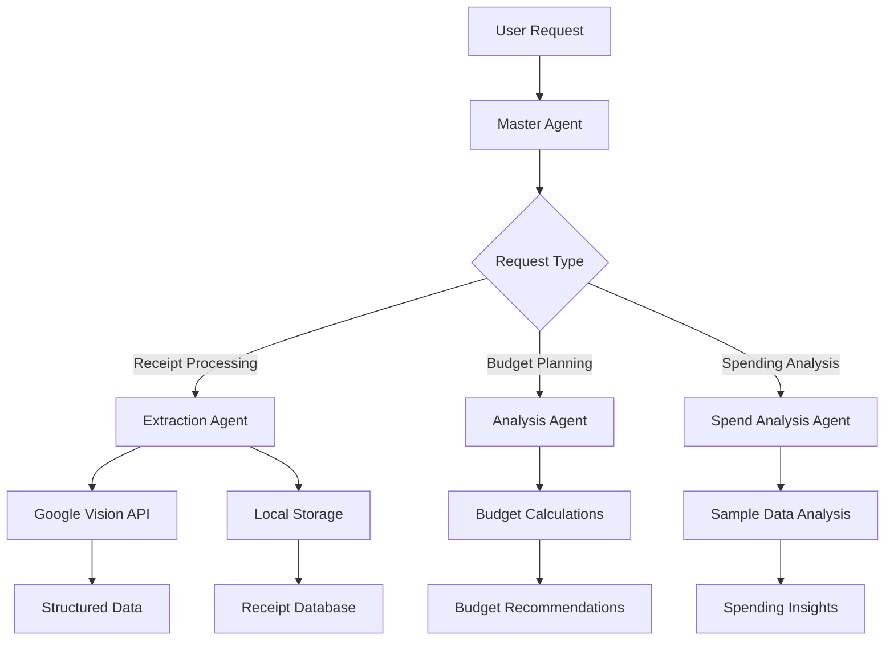

# 🏦 ProjectRaseed - Intelligent Financial Management System

[](https://www.python.org/downloads/)
[](https://fastapi.tiangolo.com/)
[](https://cloud.google.com/vision)
[](https://firebase.google.com/)

> **ProjectRaseed** is a comprehensive financial management system that combines receipt processing, spending analysis, and budget planning through an intelligent multi-agent architecture powered by Google's Generative AI.

## 📋 Table of Contents

- [Overview](#overview)
- [Features](#features)
- [Architecture](#architecture)
- [Installation](#installation)
- [Configuration](#configuration)
- [Usage](#usage)
- [API Documentation](#api-documentation)
- [Agent System](#agent-system)
- [Contributing](#contributing)
- [License](#license)

## 🎯 Overview

ProjectRaseed is an intelligent financial assistant that helps users manage their finances through:

- **📸 Receipt Processing**: Extract data from receipt images using Google Vision API
- **💰 Spending Analysis**: Analyze spending patterns with detailed insights
- **📊 Budget Planning**: Create personalized budget plans and recommendations
- **🎯 Multi-Agent System**: Coordinated AI agents for specialized financial tasks

## ✨ Features

### 🔍 Receipt Processing
- **OCR Text Extraction**: Extract text from receipt images using Google Vision API
- **Structured Data Parsing**: Convert raw text into structured JSON data
- **Google Wallet Integration**: Create digital wallet passes for receipts
- **Local Storage**: Store receipt data locally for analysis
- **Merchant Recognition**: Identify merchants, dates, totals, and line items

### 📊 Spending Analysis
- **30+ Sample Receipts**: Realistic sample data for testing and demonstration
- **Multi-Currency Support**: USD to INR conversion (₹83.0 rate)
- **Category Analysis**: Automatic categorization of spending
- **Merchant Analysis**: Top merchant identification and spending patterns
- **Date Range Queries**: Filter receipts by date ranges
- **Item Search**: Search for specific items across all receipts

### 💰 Budget Planning
- **Personalized Budgets**: Create budgets for any amount
- **Category Allocation**: Smart percentage-based budget breakdown
- **City-Specific Recommendations**: Location-based budget adjustments
- **Money-Saving Tips**: Category-specific financial advice
- **Spending Pattern Analysis**: Identify trends and opportunities

### 🤖 Multi-Agent Architecture
- **Master Agent**: Coordinates between specialized agents
- **Extraction Agent**: Handles receipt processing and OCR
- **Analysis Agent**: Manages budget planning and recommendations
- **Spend Analysis Agent**: Queries and analyzes spending data

## 🏗️ Architecture

```
ProjectRaseed/
├── api/                          # FastAPI REST API
│   ├── main.py                   # Main API endpoints
│   ├── config.py                 # Configuration management
│   └── run.py                    # API server runner
├── MASTER/                       # Master agent system
│   ├── agent.py                  # Master agent coordinator
│   └── Slaves/                   # Specialized agent modules
│       ├── extraction_agent/     # Receipt processing agent
│       ├── analysis_agent/       # Budget planning agent
│       └── SpendAnaysis/         # Spending analysis agent
└── requirements.txt              # Python dependencies
```

### Agent System Flow



## 🚀 Installation

### Prerequisites

- Python 3.11 or higher
- Google Cloud Platform account
- Firebase project setup
- Google Vision API enabled

### Step 1: Clone the Repository

```bash
git clone <repository-url>
cd ProjectRaseed
```

### Step 2: Create Virtual Environment

```bash
python -m venv venv
source venv/bin/activate  # On Windows: venv\Scripts\activate
```

### Step 3: Install Dependencies

```bash
pip install -r requirements.txt
```

### Step 4: Environment Configuration

Create a `.env` file in the root directory:

```env
# Google Cloud Configuration
GOOGLE_CLOUD_API_KEY=your_google_cloud_api_key
GOOGLE_CLOUD_PROJECT=project-raseed-467107
GOOGLE_APPLICATION_CREDENTIALS=path/to/service-account.json

# Google Vision API
GOOGLE_VISION_API_KEY=your_vision_api_key

# Google Gemini API
GOOGLE_GEMINI_API_KEY=your_gemini_api_key
```

## ⚙️ Configuration

### Google Cloud Setup

1. **Create a Google Cloud Project**:
   - Go to [Google Cloud Console](https://console.cloud.google.com/)
   - Create a new project or select existing one

2. **Enable Required APIs**:
   ```bash
   gcloud services enable vision.googleapis.com
   gcloud services enable firestore.googleapis.com
   gcloud services enable walletobjects.googleapis.com
   ```

3. **Create Service Account**:
   - Go to IAM & Admin > Service Accounts
   - Create new service account with appropriate permissions
   - Download JSON key file

4. **Set Up Firebase**:
   - Go to Firebase Console
   - Create new project or link existing Google Cloud project
   - Enable Firestore database

### API Keys Configuration

1. **Google Vision API Key**:
   - Enable Vision API in Google Cloud Console
   - Create API key in Credentials section

2. **Google Gemini API Key**:
   - Go to [Google AI Studio](https://makersuite.google.com/app/apikey)
   - Create new API key

## 📖 Usage

### Starting the API Server

```bash
cd api
python run.py
```

The API will be available at `http://localhost:8000`

### API Endpoints

#### 1. Health Check
```bash
GET /health
```

#### 2. Chat with Financial Assistant
```bash
POST /chat
Content-Type: application/json

{
  "message": "Create a budget for $5000",
  "user_id": "user123"
}
```

#### 3. Upload Receipt
```bash
POST /upload-receipt
Content-Type: multipart/form-data

file: [receipt_image.jpg]
```

### Example Usage

#### Budget Planning
```python
import requests

response = requests.post("http://localhost:8000/chat", json={
    "message": "I have ₹50,000 budget for Mumbai",
    "user_id": "user123"
})

print(response.json())
```

#### Receipt Processing
```python
import requests

with open("receipt.jpg", "rb") as f:
    files = {"file": f}
    response = requests.post("http://localhost:8000/upload-receipt", files=files)

print(response.json())
```

## 🔧 API Documentation

### Chat Endpoint

**POST** `/chat`

Process natural language requests for financial assistance.

**Request Body:**
```json
{
  "message": "string",
  "user_id": "string (optional)"
}
```

**Response:**
```json
{
  "response": "string",
  "agent_used": "string",
  "status": "string"
}
```

### Upload Receipt Endpoint

**POST** `/upload-receipt`

Upload and process receipt images.

**Request:**
- `file`: Image file (JPEG, PNG, etc.)

**Response:**
```json
{
  "message": "string",
  "receipt_id": "string",
  "extracted_data": {
    "merchant": "string",
    "total": "string",
    "date": "string",
    "items": []
  }
}
```

## 🤖 Agent System

### Master Agent (`MASTER/agent.py`)

The central coordinator that routes requests to specialized agents:

- **Receipt Processing**: Routes to Extraction Agent
- **Budget Planning**: Routes to Analysis Agent  
- **Spending Analysis**: Routes to Spend Analysis Agent

### Extraction Agent (`MASTER/Slaves/extraction_agent/`)

Handles receipt image processing:

- **OCR Processing**: Uses Google Vision API
- **Data Extraction**: Parses structured data from raw text
- **Wallet Integration**: Creates Google Wallet passes
- **Local Storage**: Stores receipt data as JSON files

**Key Functions:**
- `extract_and_store()`: Process receipt images
- `create_wallet_pass_for_receipt()`: Generate wallet passes
- `list_receipts()`: List stored receipts
- `get_receipt_details()`: Retrieve specific receipt data

### Analysis Agent (`MASTER/Slaves/analysis_agent/`)

Provides budget planning and financial advice:

- **Budget Creation**: Generate personalized budget plans
- **Category Allocation**: Smart percentage-based breakdowns
- **Savings Tips**: Category-specific financial advice

**Key Functions:**
- `create_budget_plan()`: Generate budget breakdowns
- `get_savings_tips()`: Provide money-saving advice

### Spend Analysis Agent (`MASTER/Slaves/SpendAnaysis/`)

Analyzes spending patterns and provides insights:

- **Sample Data**: 30 realistic sample receipts
- **Multi-Currency**: USD to INR conversion
- **Category Analysis**: Automatic spending categorization
- **Query System**: Flexible data querying

**Key Functions:**
- `query_by_merchant_tool()`: Find receipts by merchant
- `get_spending_statistics_tool()`: Generate spending statistics
- `get_category_breakdown_tool()`: Analyze spending by category
- `get_top_merchants_tool()`: Identify top spending merchants

## 📊 Sample Data

The system includes 30 realistic sample receipts with:

- **Merchants**: Walmart, Target, Amazon, Starbucks, etc.
- **Categories**: Restaurant, Grocery, Electronics, Gas, Pharmacy, Coffee
- **Items**: Realistic product names and prices
- **Dates**: Spread across 60 days
- **Amounts**: Varied from $5 to $200+

## 🔍 Troubleshooting

### Common Issues

1. **API Key Errors**:
   - Verify all API keys are set in `.env`
   - Check Google Cloud project permissions

2. **Service Account Issues**:
   - Ensure service account JSON file exists
   - Verify file path in configuration

3. **Vision API Errors**:
   - Enable Vision API in Google Cloud Console
   - Check API quota and billing

4. **Firebase Connection**:
   - Verify Firebase project setup
   - Check Firestore database rules

### Debug Mode

Enable debug logging by setting environment variable:
```bash
export DEBUG=True
```

## 🤝 Contributing

1. Fork the repository
2. Create a feature branch (`git checkout -b feature/amazing-feature`)
3. Commit your changes (`git commit -m 'Add amazing feature'`)
4. Push to the branch (`git push origin feature/amazing-feature`)
5. Open a Pull Request

### Development Setup

```bash
# Install development dependencies
pip install -r requirements.txt

# Run tests
python -m pytest

# Format code
black .

# Lint code
flake8 .
```

## 📝 License

This project is licensed under the MIT License - see the [LICENSE](LICENSE) file for details.

## 🙏 Acknowledgments

- **Google Cloud Vision API** for OCR capabilities
- **Google Generative AI** for intelligent processing
- **Firebase Firestore** for data storage
- **FastAPI** for high-performance API framework

## 📞 Support

For support and questions:

- Create an issue in the GitHub repository
- Check the troubleshooting guide
- Review the API documentation

---

